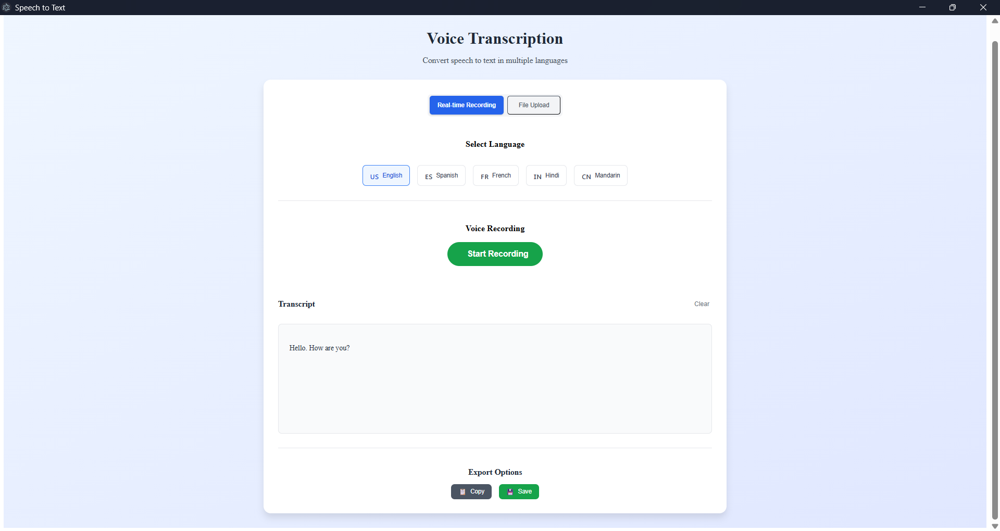
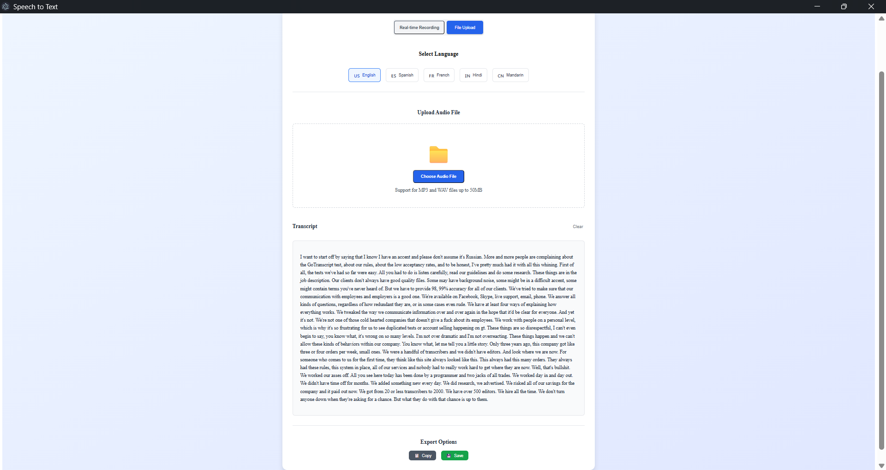

# SpeechToText

A cross-platform Electron desktop application for converting speech to text using real-time recording or audio file upload. Built with React, Electron.

## Features

- 🎤 **Real-time Voice Recording**: Record audio and transcribe speech instantly.
- 📁 **Audio File Upload**: Upload MP3 or WAV files for transcription.
- 🌐 **Multi-language Support**: Transcribe speech in multiple languages.
- 📋 **Export Options**: Copy or save the transcript as a text file.
- ⚡ **Modern UI**: Responsive and clean interface using Tailwind CSS.

## Screenshots

### Real-time Recording Mode



### File Upload Mode



## Getting Started

### Prerequisites

- [Node.js](https://nodejs.org/) (v18 or newer recommended)
- [npm](https://www.npmjs.com/)

### Installation

1. Clone the repository:

   ```sh
   git clone https://github.com/const-nishant/speechtotext.git
   cd speechtotext
   ```

2. Install dependencies:
   ```sh
   npm install
   ```

### Running the App

Start the Electron app in development mode:

```sh
npm start
```

> **Note:** The app expects a backend server running at `http://localhost:3001` for speech-to-text processing.

### Building for Production

To package the app for distribution:

```sh
npm run make
```

The output will be in the `out/` directory.

## Project Structure

```
src/
  App.jsx                 # Main React component
  index.jsx               # Entry point for React
  main.js                 # Electron main process
  renderer.js             # Electron renderer entry
  components/             # React UI components
  index.css               # Tailwind and custom styles
webpack.*.js              # Webpack configuration
tailwind.config.js        # Tailwind CSS config
forge.config.js           # Electron Forge config
```

## Customization

- **Languages**: Add or remove languages in `src/components/LanguageSelector.jsx`.
- **Backend**: Update API endpoints in `src/App.jsx` as needed.

## Backend

https://github.com/const-nishant/speechtotext-backend

## Note

-Tailwind doesn't work for this project
